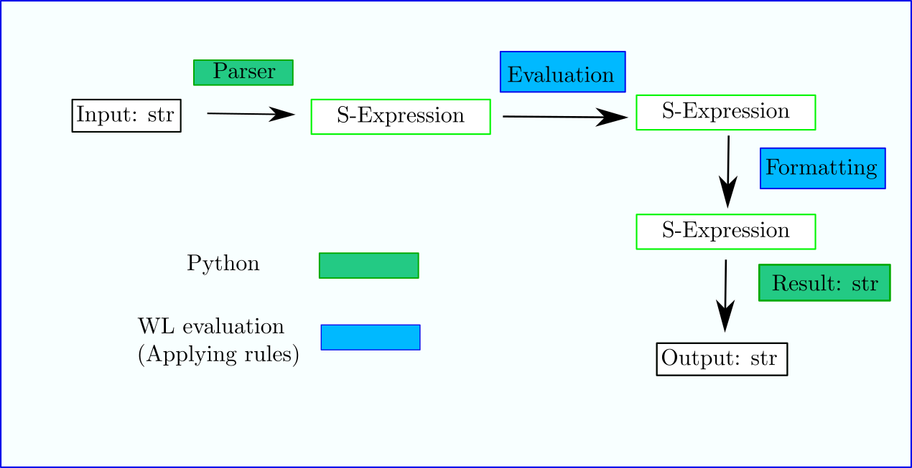

Top-level Eval and Display
==========================

.. contents::

Definitions
-----------

Front-ends like (django, mathicsscript, mathics, MathicsSession)
create a ``Definitions`` object which initially has definitions of the
thousand or so standard Mathics Builtins.  Front ends can customize
these definitions. Usually more variables are added under the
``Settings`` name space.  For example, for mathicsscript there is
a variable containing the syntax-highlighting style to use; it can be altered.
Also there is a list of all possible syntax styles styles which is not alterable and not
in the ``Settings`` namespace. For Django, there is a Boolean setting indicating whether or
not to use a sans-serif font.

Evaluation
----------

In order to process input requests, an ``Evaluation`` object needs to be
created using some set of definitions. (Right now a
new one is created for each expression, but this might not be needed.)

This evaluation object has a scan-and-parse method which is passed some sort of
I/O handle to read from. The result of that is another S-expression
described in :ref:`AST <ast>`.

This S-expression result is then passed into to the ``evaluate()``
method of the evaluation object. Evaluation may add, delete or change
definitions, so a front end will want definitions to persist in a
Mathics session while the Evaluation object may or may not.

The sequence: tokenize input, parse tokens, and evaluate is common. So
there is a method on the evaluation method call
``parse_evaluate()`` that does all 3 of these things.

The diagram below indicates this process

The result from a top-level evaluation is a special ``Result`` kind of object containing:
* ``out``:  a Python list containing all the messages and printed strings produced
* ``line_no``: the last line number for how far in the input progressed. This is most useful if there was an error.
* ``result``: a Python object containing the formatted version of the result of the evaluation
* ``last_eval``: the last result of the evaluation (an S-Expression), without formatting.

Formatting
----------

Here we describe the formatting process that produces ``result`` from
``last_eval``. *Note: In the future this may get removed form Mathics
core and front-ends will do this process outside of the Mathics core.*

In the current implementation, this work is done by the
method ``format_output()``. This method receives two arguments: the
expression and a string, indicating the format.  According to the
format, the expression first is wrapped as the argument of a Mathics
``Format`` expression. Then, the method ``format()`` from the
resulting ``Expression`` object is called, which produces a ``Box``
expression. This box expression is at the end converted into a string
by means of the method ``Expression.boxes_to_text``, and is what at
the end will be processed and shown in the front end.

Most of the format is actually performed by the ``Expression.format``
method. This method does its task in two steps. In a first step, the
``self.do_format()`` method is called. This method applies all the format
rules associated to the header and leaves of the expression
recursively.  The result of this is a new expression, with certain
subexpressions transformed according the rules.  Then,
``Expression.format`` applies the ``MakeBoxes`` rules. ``MakeBoxes``
then produces es formatted expression consisting of ``Box`` symbols,
lists, strings, and BoxConstruct objects. The last ones are a kind of
"atoms" that represents the textual representation of a certain
Expression (``Graphics``, ``Graphics3D``, ``CompìledCode``, ...).  If
some of the leaves of the expression is wrapped inside a
``MathMLForm`` (``TeXForm``) expression, the corresponding box
expression is produced by first applying evaluating
``MakeBoxes[leaf]``, then converted into a some of Python object like
a string by calling the ``boxes_to_mathml()`` (or ``boxes_to_tex``)
method of the resulting Expression, converting it into a ``String`` or
some other object and then putting this inside a ``RowBox[{}]``.
