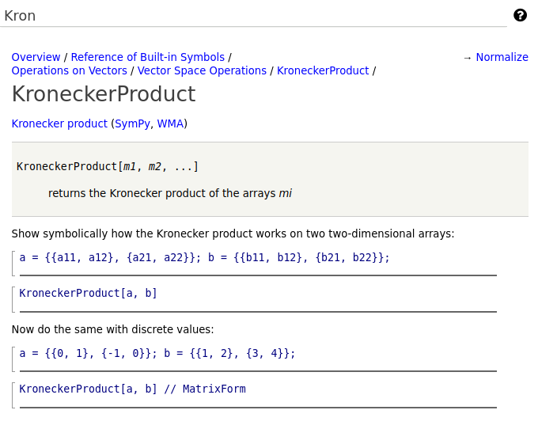

Checking the ``KroneckerProduct[]`` Skeletal Version
====================================================

As before with ``Undefined`` although there is code to wrote, we have
entered enough to be able to see that the builtin has been added, and
that we can get some information about it.

So again, let us try this much. Fire up a a version Django interface that has
access to the *development* version of mathics-core

.. code-block::

    $ cd Mathics3/mathics-django
    $ make runserver
    Watching for file changes with StatReloader
    Performing system checks...

    System check identified no issues (0 silenced).
    August 21, 2022 - 01:19:05
    Django version 4.0.5, using settings 'mathics_django.settings'
    Starting development server at http://127.0.0.1:8000/

Connect to ``http://127.0.0.1:8000`` or the address above and go into
the "about" section and see that you are using right version of
mathics core.

Finally click the "?" at the extreme right and type "Undef". You should
see the information that you added in the docstring:

You should check the following links shown in blue:

* Kronecker product,
* SymPy, and
* WMA

to make sure these all go to the right place.

Now click on the following entry ``Normalize``. At the time of this
writing there is no preceding entry.

Now let's test. Go into Django and type "Vector Space Operations" in
the documentation section and you should see ``KroneckerProduct`` appear
first before ``Normalize``.

Click on "KroneckerProduct" in that list and we now see all of the
information in the docstring we just entered.

Next:

.. toctree::
   :maxdepth: 1

   completing
