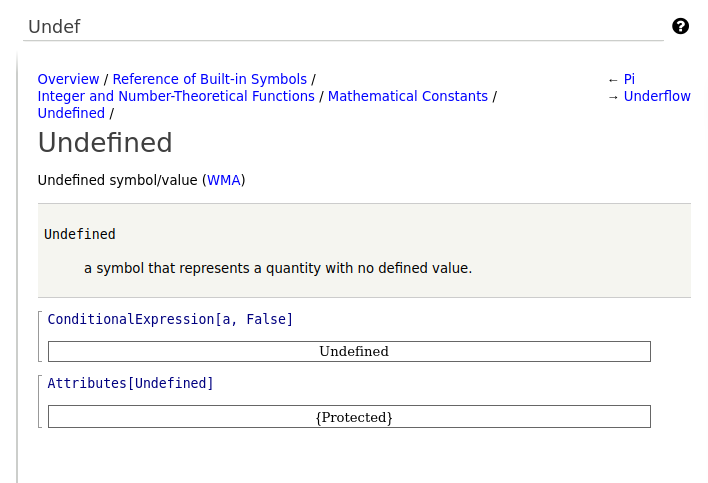

Checking the Skeletal version
==============================

Although there is more to do, the code entered so far is enough to be able to see that:

* we have added a new builtin, and
* we can get information about the builtin.

So let us try this much. Fire up a a version Django interface that has
access to the *development* version of mathics-core

.. code-block::

    $ cd Mathics3/mathics-django
    $ make runserver
    Watching for file changes with StatReloader
    Performing system checks...

    System check identified no issues (0 silenced).
    August 21, 2022 - 01:19:05
    Django version 4.0.5, using settings 'mathics_django.settings'
    Starting development server at http://127.0.0.1:8000/

Connect to ``http://127.0.0.1:8000`` or the address above and go into
the "about" section and see that you are using right version of
mathics core.

Finally click the "?" at the extreme right and type "Undef". You should
see the information that you added in the docstring:

Click on the link WMA in blue and you should see the WMA documentation
for this.  You can also click on the preceding entry in the
documentation ``Pi`` as well as the following entry ``Underflow`` and see that this works.

Inside the stripped-down command-line interface inside mathics core
called ``mathics`` we can also see this builtin

.. code-block:: Bash

    $ mathics --full-form

xo    Mathics3 5.0.3dev0
    on CPython 3.8.12 (heads/v2.3.4.1_release:4a6b4d3504, Jun  3 2022, 15:46:12)
    ...

    In[1]:= Undefined
    System`Undefined
    Out[1]= Undefined
    ...

We used the special flag ``--full-form`` which shows the expanded
*input*. When we typed in "Undefined" note that we got the name space filled out as ``System``.
Before adding this class it would have appeared in the namespace ``Global``.

Next:

.. toctree::
   :maxdepth: 1

   completing
