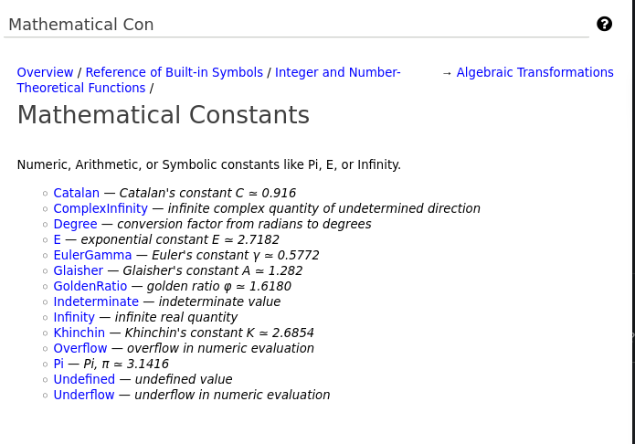

Completing ``Undefined``
========================

So far, all we have done is added a Mathics3 Builtin class for
``Undefined`` and filled out the docstring to describe it and give
some examples. We haven't filled out any implementation.

Some of the remaining things have already been filled out, but some haven't.
Here all we need to do is set some class variables:

.. code-block::

    class Undefined(Builtin):
        """
        Undefined symbol/value (<url>:WMA: https://reference.wolfram.com/language/ref/Undefined.html</url>)
	... Same as before
	"""
    """

    attributes = A_PROTECTED
    summary_text = "undefined value"


The ``attributes`` class variable sets the kind of properties or
"Attributes" that this Mathics3 Symbol has.  See `Attributes
<https://reference.wolfram.com/language/tutorial/EvaluationOfExpressions.html#9508>`_
for more information about what an attribute is and what values it
might have. Here, ``A_PROTECTED`` is a mask value that indicates that
the Symbol ``Undefined`` starts off not being able to be reassigned
to. There is an ``Unprotect`` function that can change this though.

It so happens that all Built-in symbols are functions start out this
way, so setting this class variable is not needed. However I like to
be explicit.  See :ref:`Adding Builtin Function ``KroneckerProduct```
for an example we need to set attributes other than "protected".

Assigning to ``summary_text`` does two things:

* It adds this text in Mathics3 Django in the list of functions in the section it appears
* It supplies text in the command-line for ``?`` or ``Information`` where ``Longform`` option is set to ``False``.

To make sure we have ``summary_text`` assigned a value, there is a
unit test that checks this.

Now let us look at this in the Django front end. As noted above, the
section head "Mathematical Constants". Here is a screenshot for that
section:



I searched on the prefix "Mathematical Con" which is the leading prefix that makes "Mathematical Constants" unique.

To see the effect of ``summary_text`` in the CLI, we will use the stripped down ``mathics`` program that comes with ``mathics-core``:

.. code-block:: Bash


    $ mathics

    Mathics3 5.0.3dev0
    on CPython 3.8.12 (heads/v2.3.4.1_release:4a6b4d3504, Jun  3 2022, 15:46:12)
    ...

    In[1]:= ?Undefined
    undefined value
    Out[1]= Null


The completed class definition for ``Undefined`` can be found `on github <https://github.com/Mathics3/mathics-core/blob/master/mathics/builtin/numbers/constants.py>`_.

Next:

.. toctree::
   :maxdepth: 1

   testing
