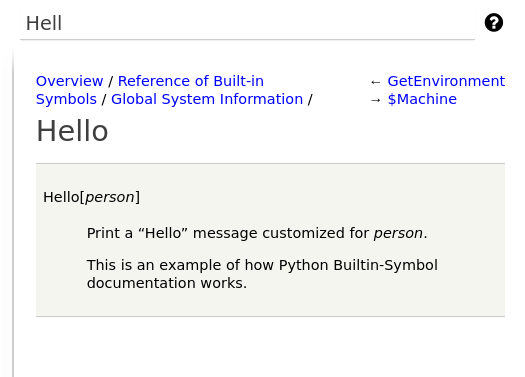
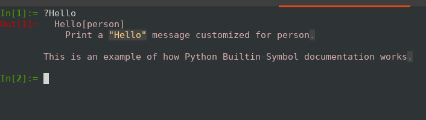

Adding Help (``Information[]``) Text
------------------------------------

.. index:: Information text, help text

Now let us add some help to the *Hello* function so that World will
know about it. This is done by adding a class variable
``summary_text`` and by adding XML/HTML markup in the docstring for the *Hello*
class.

.. code-block:: python

  from mathics.builtin.base import Builtin, String
  from mathics.core.evaluation import Evaluation

  class Hello(Builtin):
    """
    <dl>
      <dt>Hello[$person$]
      <dd>Print a "Hello" message customized for $person$.

    This is an example of how Python Builtin-Symbol documentation works.
    </dl>
    """

    summary_text = 'prints "Hello, <name>"'

    def eval(self, person: String, evaluation: Evaluation) -> String:
      "Hello[person_String]"
          return String(f"Hello, {person.value}!")

The class variable ``summary_text`` provides the text when you type ``?Hello``::

    In[1]:= ?Hello
    prints "Hello <name>"
    Out[1]= Null

    In[2]:= ??Hello

        Hello[person]
            Print a "Hello" message customized for person.

        This is an example of how Python Builtin-Symbol documentation works.

        Attributes[Hello] = {Protected}

    Out[2]= Null

    In[3]:= Hello["Rocky"]
    Out[3]= "Hello, Rocky!"

The XML tagging that gets created from the above renders in the Django
interface like this:

In the Django interace on the right-hand side, I hit the "?" button and started typing "H E L L" and that was enough for the Django to find it. Django will pick up this change without having to restart it!

This is how the text appears geting help via ``?`` in ``mathicsscript``:

See :ref:`For Help Text <doc_help_markup>` for more a list of help-related markup.
