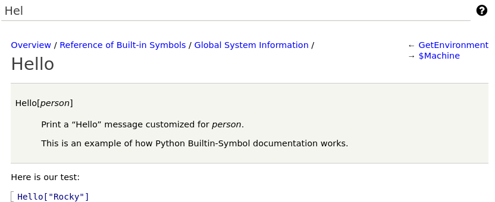

Writing Document Tests
----------------------

In addition to the help text given before, we can also provide
examples that are shown in the documentation, can be run interactively
in the Django interface, and get run automatically during CI testing.

Here is the docstring from the last section expanded with a test.

.. code-block:: python

  from mathics.builtin.base import Builtin, String

  class Hello(Builtin):
    """
    <dl>
      <dt>Hello[$person$]
      <dd>Print a "Hello" message customized for $person$.

    This is an example of how Python Builtin-Symbol documentation works.
    </dl>

    Here is our test:
    >> Hello["Rocky"]
     = Hello, Rocky!
    """
    def eval(self, person: String, evaluation: Evaluation) -> String:
      "Hello[person_String]"
          return String(f"Hello, {person.value})!"

Here is how to run the "Hello" tests from the command line:

::

   $ python mathics/test.py --section Hello
   Testing section Hello
     1 ( 0): TEST Hello["Rocky"]

   OK

Here is how this looks in the Django interface

If you hover to the right of this test an equals sign (``=``) appears and if you click on that, the test copied to the main evaluation window and run.

See :ref:`Markup for Testing <doc_test_markup>` for more a list of test-related markup.

Next:

.. toctree::
   :maxdepth: 1

   4-patterns
